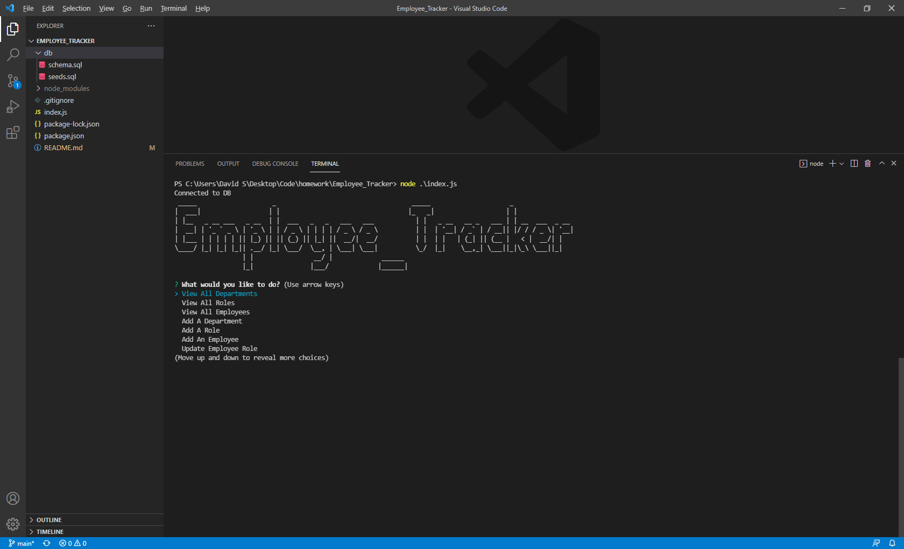

# Employee_Tracker

## Description
Allows a user to update a database of employees, managers, and roles

## Table of Contents

- [Example](#example)
- [Links](#links)
- [Installation](#installation)
- [Usage](#usage)
- [License](#license)
- [Contributing](#contributing)
- [Tests](#tests)
- [Questions](#questions)

 ## Example:



 ## Links
https://github.com/davidschepis/Employee_Tracker

https://drive.google.com/file/d/15eRKAMbCGg26KymAVeLQJRxGbHn0sbjP/view

 ## Installation
To install necessary dependencies, run the following command:

```
npm i
```

 ## Usage
Please run the included schema and seeds sql files before using this application

 ## License
This project is not licensed

 ## Contributing
Please contact me if you wish to contribute

 ## Tests
To run tests, run the following command:

```
Currenty, this application has no tests
```

 ## Questions
Please contact me at [davids.developer@outlook.com](mailto:davids.developer@outlook.com) with any questions.
Github Repo: [davidschepis](https://github.com/davidschepis).
